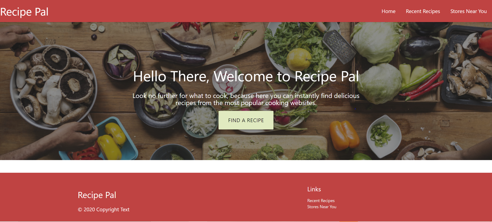
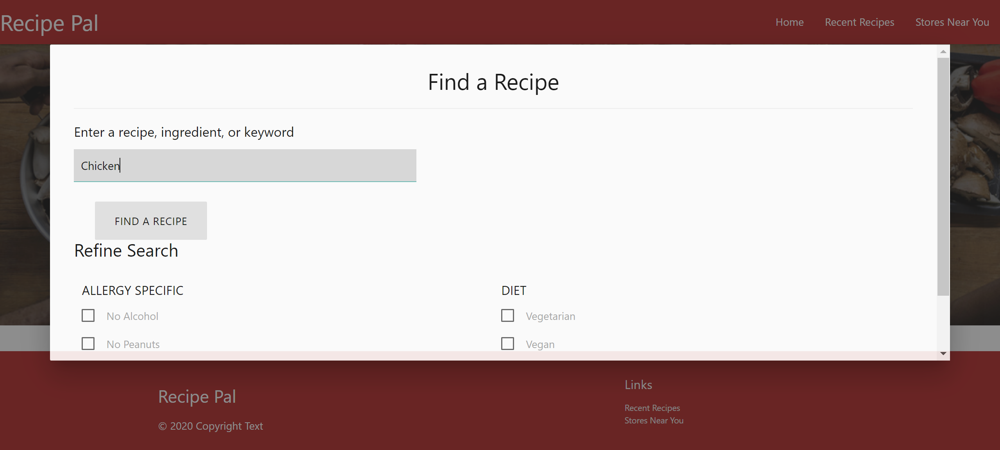
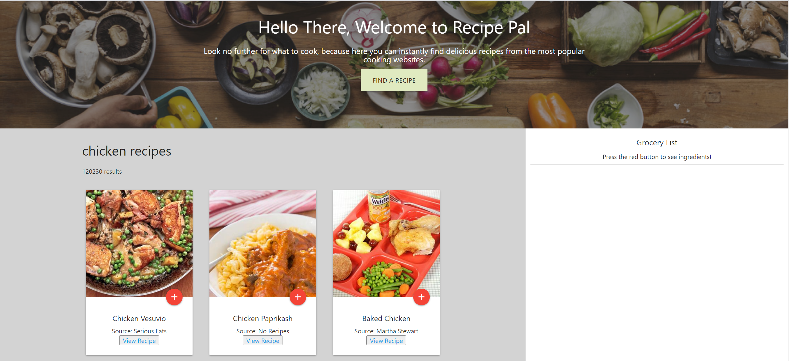
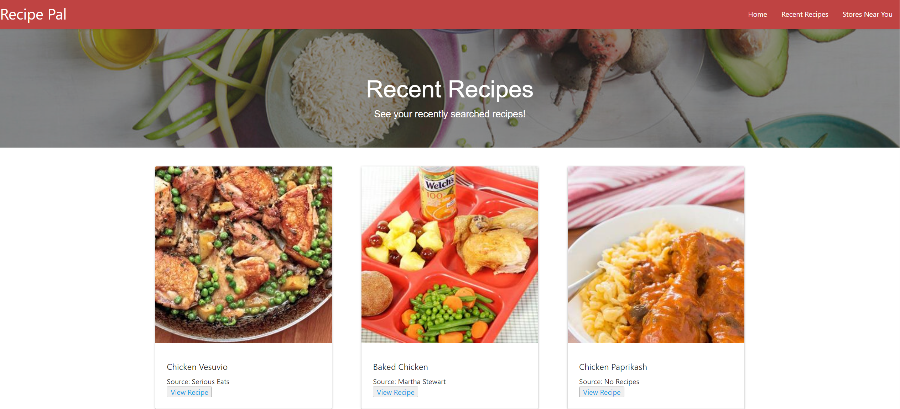
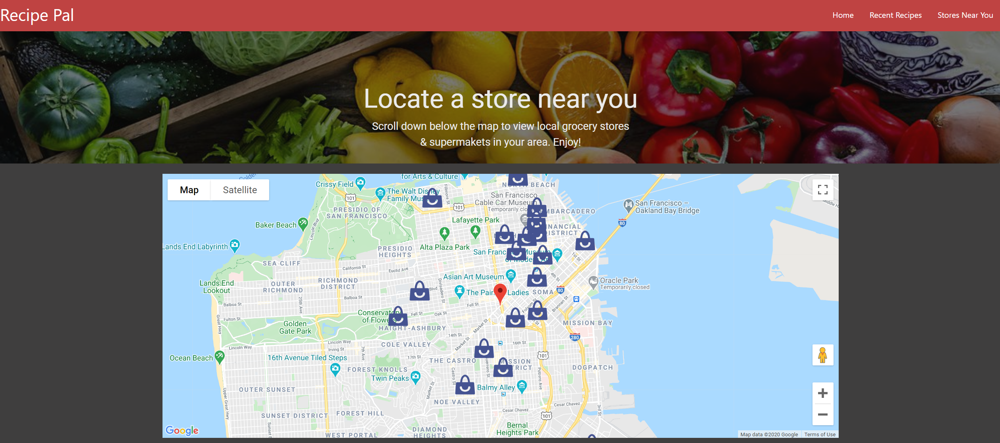

# Recipe Pal

## About The Repository

### Summary

This repository contains a food application called Recipe Pal, which is powered by Javascript, Materialize, jQuery, and Google Fonts. This application utilizes two APIs:

1. https://developer.edamam.com/edamam-docs-recipe-api
2. https://developers.google.com/places/web-service/search

Recipe Pal utilizes these technologies and APIs to:

- Display a modal to intake user input
- Display recipes based off user input
- Have a clean, responsive, polished UI
- Save the user's selections in LocalStorage
- Display grocery stores within the area

### Functionality

A user will click the "Find A Recipe" button to begin their search. A modal will pop up, which intaks the user's search criteria. The first API is used to obtain recipe information based off the user's search criteria. This information is then displayed below in materialize cards. A recipe can be viewed on the source website by clicking the "view recipe" button and a grocery list can be compiled for the user by clicking the red button. Each time the user clicks the red button the selected recipe is stored in localStorage as a "Recent Recipe". These recipes are displayed on the "Recent Recipes" page so the user can easily find recipes they used in the past.

When the user is ready to purchase the ingredients needed they will navigate to the "Store Near You" page. The second API utilizes the user's location, if the user allows it, to find all grocery store locations within a 5K meter radius. The webpage will then display a list of all open grocery stores in the area.

## Website Mock

Website URL: https://kaylamuraoka.github.io/Food_Application/

### Recipe Pal:

Start:

Recipe Modal:

Recipe Results:

Grocery List:

Recent Recipes:

Store Locator:

Open Stores:

