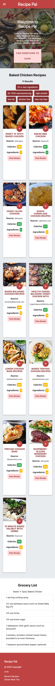

# Recipe Pal - recipe recommender & grocery store locator

## Description

We created Recipe Pal A place where you can search for recipes, filter by preference, easily view ingredients required and add to your own customized grocery list. Our website makes it easy to locate OPEN grocery stores and supermarkets nearby. So you can plan your perfect night cooking at home for family and friends, or for oneself, within a few clicks!

This repository contains a food application called Recipe Pal, which is powered by Javascript, [**Materialize**](https://materializecss.com/) CSS Framework, jQuery, and Google Fonts. This application utilizes three APIs:

1. The [**Edamam's Recipe Search API**](https://developer.edamam.com/edamam-docs-recipe-api) allowed us to scrape over 200,000 of the most popular recipes from the best cooking sources and blogs on the web. This specific recipe search api also allowed us enhance the user experience by allowing the user to filter our recipe searches by calorie, diet, ingredient, and allergy preferences.

2. The [**Google Maps JavaScript API**](https://developers.google.com/maps/documentation/javascript/overview) allowed us to add a google map to the grocery store locator page of our application. We learned that when we called the Google maps Javascript API with our browser's geolocation feature enabled we could fetch the latitude and longitude coordinates of the user’s current location and in turn center the map to the user’s current location.

3. The [**Google Maps Places API**](https://developers.google.com/places/web-service/overview) calls a nearby search request to recommended grocery stores and supermarkets that are within a 5,000 meter radius of the user’s current location and that are open.

Recipe Pal utilizes these technologies and APIs to:

- Display a modal to intake user input
- Display recipes based off user input
- Have a clean, responsive, polished UI
- Save the user's selections in LocalStorage
- Display grocery stores within the area

## Functionality

A user will click the "Find A Recipe" button to begin their search. A modal will pop up, which intaks the user's search criteria. The first API is used to obtain recipe information based off the user's search criteria. This information is then displayed below in materialize cards. A recipe can be viewed on the source website by clicking the "view recipe" button and a grocery list can be compiled for the user by clicking the red button. Each time the user clicks the red button the selected recipe is stored in localStorage as a "Recent Recipe". These recipes are displayed on the "Recent Recipes" page so the user can easily find recipes they used in the past.

When the user is ready to purchase the ingredients needed they will navigate to the "Store Near You" page. The second API utilizes the user's location, if the user allows it, to find all grocery store locations within a 5K meter radius. The webpage will then display a list of all open grocery stores in the area.

## Mock-Up

The following animation shows the web application's appearance and functionality:

##### "Home" Page Demo:

##### "Recent Recipes" Page Demo:

##### "Stores Near You" Page Demo:

Our Application is responsive; the layout and content responds and adapts based on the size of screen they are presented on. See Example Below:

|                 Small devices (ex: Portrait phones (<544px))                  |                 Medium devices (ex: Tablets (≥768px - <992px))                 |                     Large devices (ex: Desktops (≥992px))                     |
| :---------------------------------------------------------------------------: | :----------------------------------------------------------------------------: | :---------------------------------------------------------------------------: |
|  |  |  |

## Table of Contents

- [Installation](#installation)
- [Usage](#usage)
- [Credits](#credits)
- [License](#license)

## Installation

You'll need to use the [**Edamam's Recipe Search API**](https://developer.edamam.com/edamam-docs-recipe-api). To get started using the API you will first need to [**sign up**](https://developer.edamam.com/edamam-recipe-api) with your email and you will get your API key. The [**Edamam's Recipe Search API documentation**](https://developer.edamam.com/edamam-docs-recipe-api) is an essential guide with real examples and comprehensive description of API calls, responses and its parameters.

In addition, you'll need to use the [**Google Maps JavaScript API**](https://developers.google.com/maps/documentation/javascript/overview) and [**Google Maps Places API**](https://developers.google.com/places/web-service/overview). If you have never used the Google Cloud console for a project, follow these steps to [**Get started with Google Maps Platform**](https://developers.google.com/maps/gmp-get-started). Make sure that both the Maps JavaScript API and the Places AP is enabled. Once you are set up, you can begin using the Google Maps Platform APIs.

To install this project locally clone this [**project repository**](https://github.com/kaylamuraoka/Food_Application) to create a local copy on your computer and sync between the two locations. You may then modify the code to your liking. For steps on how to clone a repository using the command line, read this section of the GitHub Docs [**about cloning a repository**](https://docs.github.com/en/free-pro-team@latest/github/creating-cloning-and-archiving-repositories/cloning-a-repository#about-cloning-a-repository).

## Usage

The Recipe Pal web application can be viewed at this [**link**](https://kaylamuraoka.github.io/Food_Application/).

## Credits

The Recipe Pal web application was created by [**Sam Ayler**](https://github.com/sayler3), [**Lauren Hutchinson**](https://github.com/lhutchinson22), [**Kayla Muraoka**](https://github.com/kaylamuraoka), and [**Jason Richards**](https://github.com/jrkrichards).

## License

